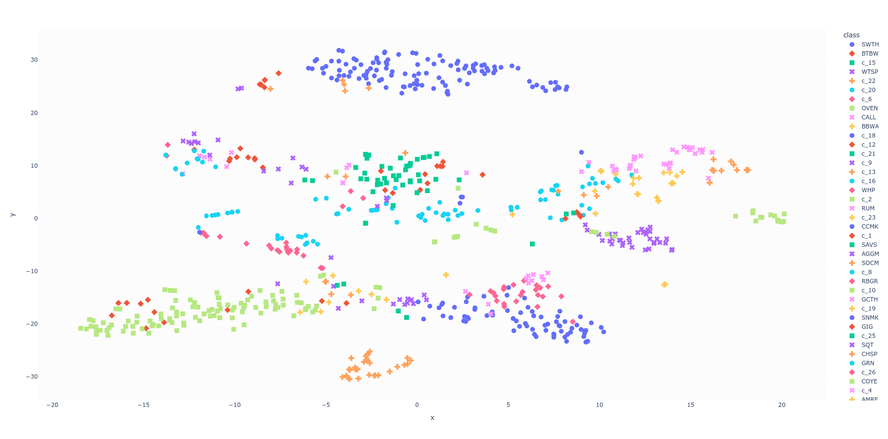
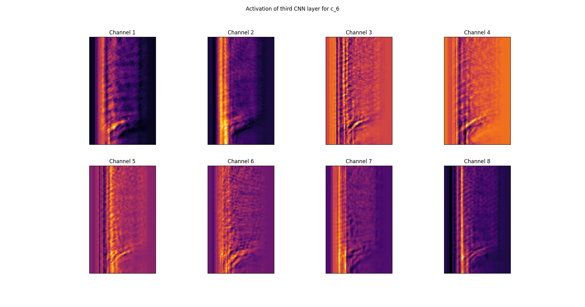

# Few-Shot-Bioacustic-SED

This project is designed for the Audio Pattern Recognition course attended at the University of Milan and it proposes an approach for addressing the Few-Shot Bioacustic Sound Event Detection (SED) task for the [DCASE 2023 Challenge](https://dcase.community/challenge2023/task-few-shot-bioacoustic-event-detection).\
The Few-Shot-Learning (FSL) framework is followed considering the training as a 5-way 5-shot task. More precisely, *transfer learning* is used to train models on the larger training set and then finetuning is performed on the validation set of the DCASE challenge using the 5-way 5-shot strategy.\
\
The code has been tested on Ubuntu 22.04 with Python 3.10.

## Proposed approach

The proposed approach entails the design of a CNN-based module for feature extraction, leveraging the Bayesian Optimisation and HyperBand (BOHB) algorithm [[1]](https://arxiv.org/pdf/1807.01774.pdf) for model selection. The selected CNN module is then trained using an online-mining implementation [[2]](https://github.com/KevinMusgrave/pytorch-metric-learning) of the Triplet Margin Loss [[3]](https://arxiv.org/pdf/1503.03832.pdf) and it is used as feature extractor for a Siamese Network and a Relation Network. The CNN tries to learn useful features in a latent space, which can be visualised as follows:

 All networks are trained on features obtained applying Per-Channel Energy Normalisation (PCEN) [[4]](https://arxiv.org/pdf/1607.05666.pdf) on Mel-spectrograms extracted from the sound events of interest, while a visualisation of the activation map of the CNN is shown below:

## Other material

The `figures/` folder contains detailed representation of the networks, additional activation maps of the CNN and the plots of the learned feature space.\
In the `serialized/` folder, training, validation and finetuning metrics are available.